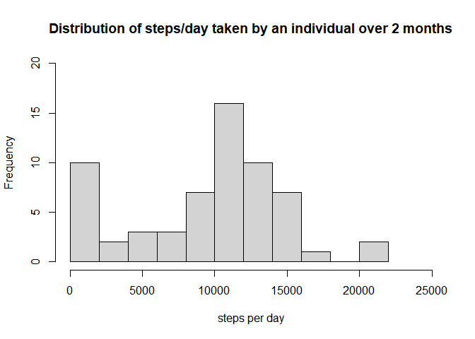
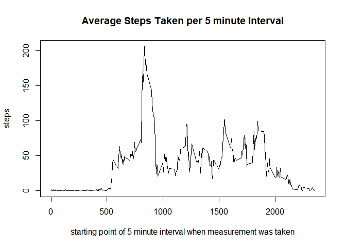
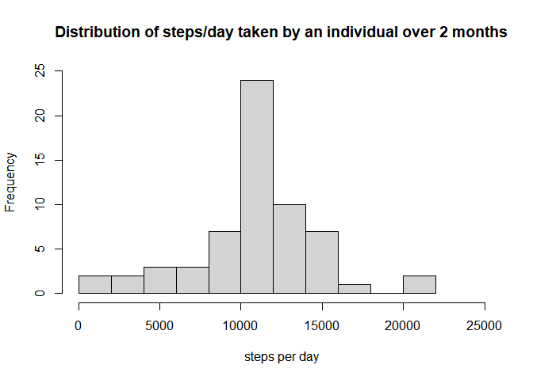
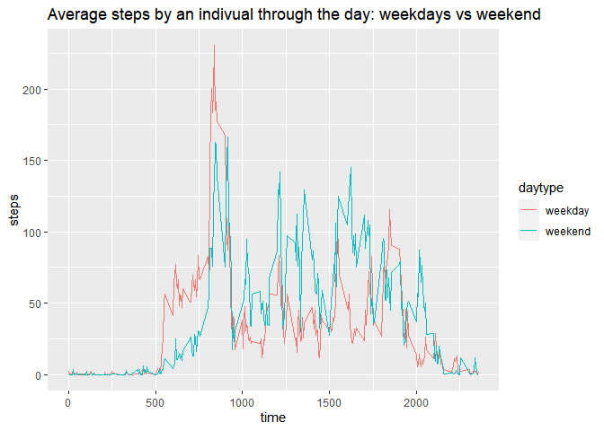

The goal of this project is to analyze the activity pattern of an anonymous individual during the months of October and November of 2012. To that end, I will use data collected from a personal activity monitoring device. This is to complete the first project of the Reproducible Research course taught by Dr. Roger Peng.  

## Loading and preprocessing the data
The data for the project were made accessible by Dr. Peng in a repository in Github. I forked and cloned the repository. The present file is in the forked repository.

I used the following code to load the data from a zipped csv file:


```r
dat <- read.csv(unzip("activity.zip"))
```

The resulting data frame contains 17568 observations of 3 variables - steps, date, and interval:


```r
str(dat)
```

```
## 'data.frame':	17568 obs. of  3 variables:
##  $ steps   : int  NA NA NA NA NA NA NA NA NA NA ...
##  $ date    : chr  "2012-10-01" "2012-10-01" "2012-10-01" "2012-10-01" ...
##  $ interval: int  0 5 10 15 20 25 30 35 40 45 ...
```

In this dataframe, the variable "date" is formatted as a character, while the variable "interval" is formatted as an integer. The variable "interval" expresses time intervals of five minutes. The last two digits express the starting point of the 5 minute interval within a particular hour when a measurement was taken. The third and fourth from-last digits express the hour of the day when the measurement was taken. So, an interval coded as 1355 refers to a measurement taken from 13:55 (1:55PM) to 14:00 (2PM) on a particular day. An interval coded as 5 refers to measurements taken from 00:05 to 00:10.

I transformed the "date" variable into a Date format:

```r
dat$date <- as.Date(dat$date)
```


## What is mean total number of steps taken per day?

To calculate the total number of steps per day I used the dplyr package's group_by and summarize functions. I stored the result in a new variable, stepsday. Note that I removed the NAs in the data from the calculation. For this transformation and for several other operations in this project, I used the tidyverse package family.


```r
#loads tidyverse package
library(tidyverse)
```


```r
# calculate sum
stepsday <- dat %>% group_by(date) %>% summarize(sumsteps = sum(steps, na.rm = TRUE))
```

```r
head(stepsday)
```

```
## # A tibble: 6 x 2
##   date       sumsteps
##   <date>        <int>
## 1 2012-10-01        0
## 2 2012-10-02      126
## 3 2012-10-03    11352
## 4 2012-10-04    12116
## 5 2012-10-05    13294
## 6 2012-10-06    15420
```

The histogram below showcases the distribution of the steps taken per day by the individual under observation.


```r
hist(stepsday$sumsteps, xlab = "steps per day", main = "Distribution of steps/day taken by an individual over 2 months", breaks = 10, xlim = c(0, 25000), ylim = c(0, 20))
```

<!-- -->

I called the summary function on stepsday to retrieve the mean and median steps per day. Remember that this calculation ignores NA values.


```r
# calculate mean and median
summary(stepsday$sumsteps)
```

```
##    Min. 1st Qu.  Median    Mean 3rd Qu.    Max. 
##       0    6778   10395    9354   12811   21194
```

Over the course of the 2 months, and if we assume that the NAs in the data correspond to no walking, our individual's mean steps per day were 9354, and his median steps per day were 10395.

## What is the average daily activity pattern?

The graph below shows the average daily pattern of the subject of the study. The subject's pattern peaks after 8AM, and has several local peaks around 12PM and the mid to late afternoon and early evening. The subject's walking is reduced in the late night, and comes to zero in the early morning.


```r
#calculate average steps per 5 minute interval
dpat <- dat %>% group_by(interval) %>% summarize(averagesteps = mean(steps, na.rm = TRUE))
```


```r
# create time series plot
plot(dpat$interval, dpat$averagesteps, type = "l", xlab = "starting point of 5 minute interval when measurement was taken", ylab = "steps", main = "Average Steps Taken per 5 minute Interval")
```

<!-- -->

As the output of the code below shows, the 5 minute period in which the subject's steps are maximized is the period starting at 8:35AM, when he takes an average of 206 steps.


```r
#subset dpat, which summarizes average steps per interval, to find interval with highest average
dpat[which.max(dpat$averagesteps), ]
```

```
## # A tibble: 1 x 2
##   interval averagesteps
##      <int>        <dbl>
## 1      835         206.
```
## Imputing missing values

The data set contains 2304 missing values. 


```r
sum(is.na(dat$steps))
```

```
## [1] 2304
```

The existing of NAs has the potential to bias some calculations. For example, when we compare the total steps taken by the individual in a day, the count for those days in which there are more NAs will be biased downward.
Under the assumption that the individuals' daily patterns are roughly constant, I will input each missing value as the mean for that 5 minute interval across all days. Conveniently, the data for the mean across intervals is already stored in dpat$averagesteps.


```r
#create a function that imputes (or replace) an NA with the mean
impute.mean <- function(x) replace(x, is.na(x), mean(x, na.rm = TRUE))
#use the function to create variable steps complete with the mean of 5 minute interval instead of NAs 
dat <- dat %>% group_by(interval) %>% mutate(stepscomplete = impute.mean(steps))
sum(is.na(dat$stepscomplete))
```

```
## [1] 0
```

Once again, to calculate the total number of steps per day I used the dplyr package's group_by and summarize functions. I stored the result in a new variable, stepsdaycomplete.


```r
# calculate sum
stepsdaycomplete <- dat %>% group_by(date) %>% summarize(sumsteps = sum(stepscomplete))
```

```r
head(stepsdaycomplete)
```

```
## # A tibble: 6 x 2
##   date       sumsteps
##   <date>        <dbl>
## 1 2012-10-01   10766.
## 2 2012-10-02     126 
## 3 2012-10-03   11352 
## 4 2012-10-04   12116 
## 5 2012-10-05   13294 
## 6 2012-10-06   15420
```

The histogram below showcases the distribution of the steps taken per day by the individual under observation now that the NAs have been replaced with the 5 minute interval average accross days.


```r
hist(stepsdaycomplete$sumsteps, xlab = "steps per day", main = "Distribution of steps/day taken by an individual over 2 months", breaks = 10, xlim = c(0, 25000), ylim = c(0, 25))
```

<!-- -->

I called the summary function on stepsdaycomplete to retrieve the mean and median steps per day when NA values are inputed as the mean for the 5 minute period accross the sample. 


```r
# calculate mean and median
summary(stepsdaycomplete$sumsteps)
```

```
##    Min. 1st Qu.  Median    Mean 3rd Qu.    Max. 
##      41    9819   10766   10766   12811   21194
```

As the summary shows, relative to the calculations where NA values were removed, the mean and median have both increased. This, of course, makes complete sense, as we have inputed steps to intervals of time that, previously, did not have any steps counting towards the total for the day.

## Are there differences in activity patterns between weekdays and weekends?

For this section, I used the package lubridate to identify weekdays and weekend days.


```r
library(lubridate)
```

I began by creating a new factor variable, daytype, stating whether a measurement took place on a weekday or the weekend.


```r
#extract day type (output is 1-7, with 1 and 7 the weekend days)
dat$daytype <- wday(dat$date)
#convert daytype from integer to text
dat <- dat %>% mutate(daytype = case_when(daytype %in% c(1,7) ~ "weekend", daytype %in% c(2:6) ~ "weekday"))
#transform into factor
dat$daytype <- as.factor(dat$daytype)
```

I then calculated the means per 5 minute interval per day type, and stored in a table named pattv - patterns weekend versus weekdays. Finally, I used ggplot to create the graph:


```r
#create the frame with means by 5 minute interval by day type
pattv <- dat %>% group_by(daytype, interval) %>% summarize(meansteps = mean(stepscomplete))
```

```
## `summarise()` regrouping output by 'daytype' (override with `.groups` argument)
```

```r
#initialize the plot
g <- ggplot(pattv, aes(interval, meansteps))
# add the lines, one for each day type, and title and labels
g + geom_path(aes(group = daytype, color = daytype)) + labs(x = "time", y = "steps", title = "Average steps by an indivual through the day: weekdays vs weekend")
```

<!-- -->

As the graph shows, the weekday and weekend patterns are similar in the early morning and late night. The individual walks more on weekdays from 5 to 10. During the rest of the morning and the afternoon, the individual walks more on weekends.
